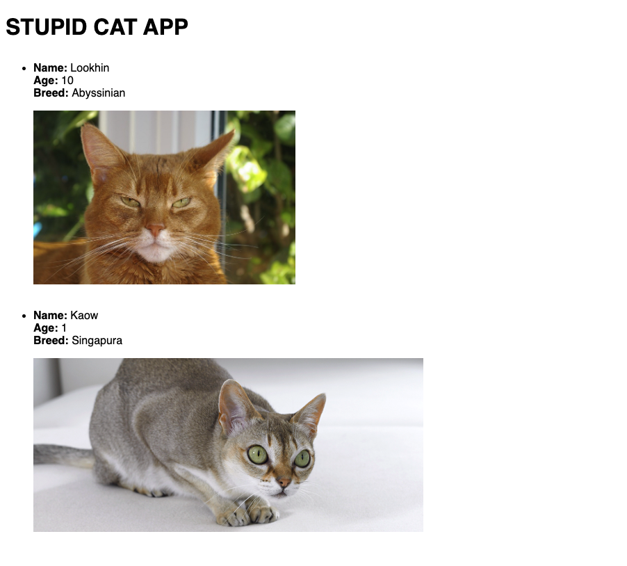

<h1>Cat App</h1>

<h2>Why just not use the Solid.js ???</h2>

Just because I want to try hard with Rust full-stack web application and that needed to complie as WASM.

<h2>Screen Shot</h2>

Thus, There is nothing here. <strong>Just a stupid full-stack app using Leptos</strong>
